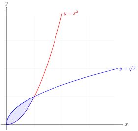

+++
title = "Math and Diagrams Demo"
date = 2025-01-15
draft = true
[extra]
toc = true
math = true
+++

A quick tour of math rendering with MathJax and diagrams with TikZJax.

<!-- more -->

## Inline Math

Euler's identity $e^{i\pi} + 1 = 0$ is often cited as the most beautiful equation in mathematics. The Gaussian integral $\int_{-\infty}^{\infty} e^{-x^2} dx = \sqrt{\pi}$ appears throughout probability theory.

## Display Math

The Cauchy integral formula:

$$f(a) = \frac{1}{2\pi i} \oint_\gamma \frac{f(z)}{z - a} \, dz$$

A numbered equation using AMS tagging:

$$\begin{equation}
\nabla \times \mathbf{E} = -\frac{\partial \mathbf{B}}{\partial t}
\end{equation}$$

## Aligned Equations

Maxwell's equations in differential form:

$$\begin{aligned}
\nabla \cdot \mathbf{E} &= \frac{\rho}{\varepsilon_0} \\\\
\nabla \cdot \mathbf{B} &= 0 \\\\
\nabla \times \mathbf{E} &= -\frac{\partial \mathbf{B}}{\partial t} \\\\
\nabla \times \mathbf{B} &= \mu_0 \mathbf{J} + \mu_0 \varepsilon_0 \frac{\partial \mathbf{E}}{\partial t}
\end{aligned}$$

## Commutative Diagrams (amscd)

$$\begin{CD}
A @>f>> B \\\\
@VVgV @VVhV \\\\
C @>>k> D
\end{CD}$$

## Theorem-like Environments

**Theorem (Stokes).** Let $M$ be a compact oriented smooth manifold with boundary $\partial M$, and let $\omega$ be an $(n-1)$-form on $M$. Then

$$\int_M d\omega = \int_{\partial M} \omega$$

Proof

By partitioning unity subordinate to a cover of $M$ by coordinate charts, we reduce to the case where $\omega$ has compact support in a single chart. The result then follows from the fundamental theorem of calculus applied coordinate-by-coordinate.

## TikZ Diagrams

## Operator Macros

The built-in macros work out of the box: $\Hom(A, B)$, $\Ext^1(M, N)$, $\Gal(K/F)$, $\Spec(R)$, $\ker(f)$, $\colim F$.

## Matrices and Cases

$$A = \begin{pmatrix} a_{11} & a_{12} & \cdots & a_{1n} \\\\ a_{21} & a_{22} & \cdots & a_{2n} \\\\ \vdots & \vdots & \ddots & \vdots \\\\ a_{m1} & a_{m2} & \cdots & a_{mn} \end{pmatrix}$$

$$|x| = \begin{cases} x & \text{if } x \geq 0 \\\\ -x & \text{if } x < 0 \end{cases}$$
