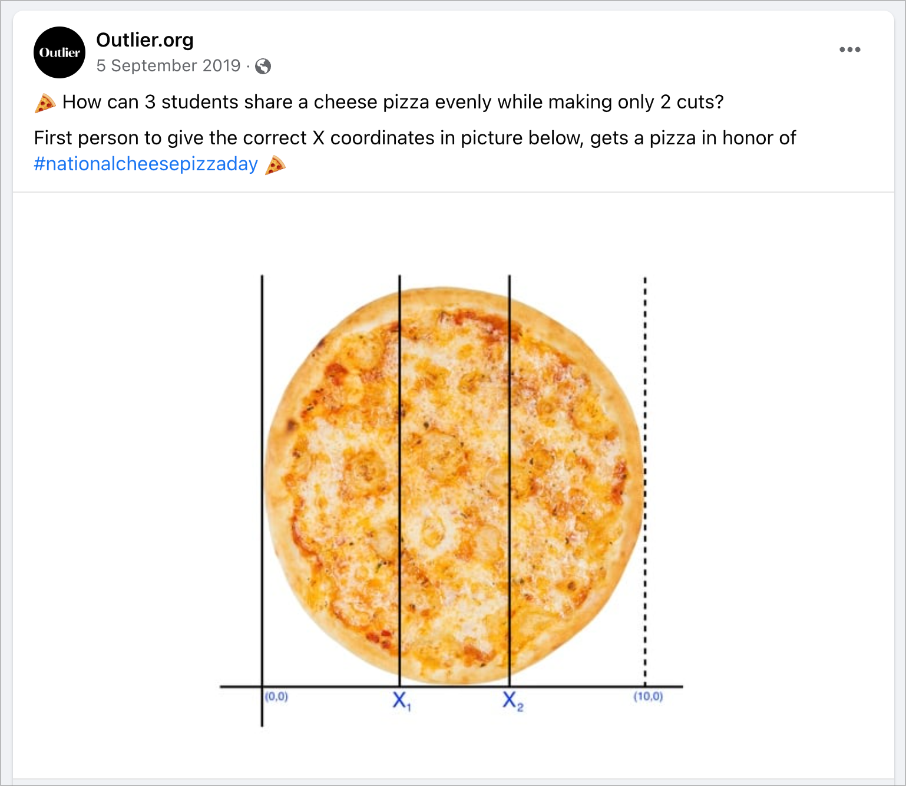

+++
title = "Slicing a pizza the mathematician way"
date = 2019-12-18
description = "Dividing a disk into equal-area rings using concentric circles"
[taxonomies]
tags = ["math", "geometry"]
categories = ["mathematics"]
[extra]
math = true
tikz = true
toc = true
+++

There's no limit to creativity. Maybe time, but it still tends to infinite.
Therefore it has no limit either.

What about pizzas? Well, pizzas can have a limit. You
slice it traditionally in $S = 1, 2, 4, 8, 16, \ldots, n$ slices or as an
alternative, cut it on segments. It's not very common to encounter a pizza
slice in segments outside Latin America. However, yesterday, one tweet brought
it to my attention to one of these online challenges requiring the follower to
slice a pizza into three equal parts, defining only two segments.



The way the graphic indicates induces the assumption that answers should be
towards creating segments with the proposed $x_1$ and $x_2$ cuts and if
you want to work this problem out, you'll probably reach the proposed solution.
Not without scratch your head recalling your geometry and trigonometry
knowledge. The solution is $x_1 = 3.675$ and $x_2 = 6.325$.

That is a solution, for sure. However, imagine using the same approach if you
continue and slice the pizza in even more parts. You're probably wondering how
can we deal with the even more complicated arc calculations that are necessary
to define the cuts proportionally.

<!-- more -->

## So, what is the alternate way, then?

During my high school years, I've stumbled across a slightly peculiar
mathematics book. It was written in Spanish, smelly, and filled up with fading
pencil page notes. I've tried to remember the book name for years, but nowadays
I'm sure that it was a translation for Kiselev's geometry book[^kiselev_1938].
Prof. Alexander Givental[^givental] adapted the Russian original text into two
volumes: Kiselev's Geometry Book I. Planimetry[^planimetry] and Book II.
Stereometry[^stereometry]. The Spanish version I had access to, was probably a
donation from some engineer who worked at the Itaipu Dam in my home city.

However, until that point in my life, my relation to mathematics leaned towards
fiddling with equations until I stumbled in the right answer, which matched the
answers sheet. I had no idea what a mathematical proof or anything in the
regular undergrad toolbox was. So I approached the problems, always repeating
the same pattern. Trying out the exercises in this book was the recipe to hit
several frustrating roadblocks as it contained a series of increased complexity
exercises. There's a point beyond a certain complexity level the math I knew
wasn't enough to find an answer.

One exercise in this book was presented similarly as the initial question
above, and whenever I see some disk this pops back on my mind.

* Construct a disk equivalent to a given ring (i.e., the figure bounded by two
  concentric circles)
* Divide a disk into $2,3 \ldots n$ equivalent parts by concentric circles.

The first part was quite easy to solve. Following the descriptive geometry
approach which the book suggests, you draw two concentric circles and shade the
area between then. I used to hate this, but nowadays I see it correlates a lot
with programming.


\begin{document}
  \begin{tikzpicture}
    \foreach \i in {1,...,7} {
      \draw (0,0) circle (\i*0.5cm);
    }
    \fill (0,0) circle (0.03cm);
  \end{tikzpicture}
\end{document}


Now with the second part, and as you may have guessed at this point, it can be
used to solve the proposed question above. There's one catch, as when it says
equivalent parts, it's talking about the area as the follow-up exercises
require this assumption.

Now we should solve the problem out to find the proportionality between the
radii and the number of partitions. The naively wrong approach would assume we
can divide the radius into $n$ parts as the picture above, and the problem
would be solved. Unfortunately, that's not that straightforward as the areas
would be different.

Prof. Carlos, was not my actual teacher but enjoyed a good conversation and a
challenge. He was mentoring me out of my mathematical misery. He gave me books,
problems, and steered me in the right direction. Not always, as he also gave me
misdirected hints to see if I was not distracted from the problem. I still
remember the day we solved this puzzle. He introduced me to several concepts
I'd only fully understand later in my studies as induction, series, limits, and
integration.

However, back to the problem, that this is going to get interesting. Let's
outline our facts about it.

- Given the radius of the outer circle as $R$ or $r_n$
- Given the area of a circle is $A=\pi R^2$
- Let the radius of the inner concentric circles (including the central point)
  be $(r_0, r_1, \ldots, r_{n-1})$

- Therefore $r_{n} = \sum_{i = 0}^{n-1} (r_i)$ or the outer radius is the
  sum of all inner radius

The above statements define our problem and set some relationships between the
concentric circles, but what we want is to express the area proportional across
all rings as $A_n = \frac{\pi R^2}{n}$ and find the relationship between the
radius that satisfies this statement.

It's probably not a surprise to you that the ring-shaped object is the region
bounded by two concentric circles has a name, and it's called
Annulus[^annulus]. Furthermore, the area of an annulus is the difference in the
areas of the larger circle of radius $R$ and the smaller one of radius $r$. I
won't enter the realm of calculus at this moment, but this can be archived
using Polar integration[^polar_integration], and that would blow up my initial
argument that the first solution was verbose.

- Given $A_{annulus} = \pi\left(R^2 - r^2\right)$

- $A_0 = \pi \cdot 0$

- $A_1 = \pi(r_1^2-r_{0}^2) = \pi r_1^2$

The area of a ring as the difference between itself and its inner concentric
circle as $A_i = \pi(r_i^2-r_{i-1}^2)$

We want to make $A = \pi(r_i^2-r_{i-1}^2) + \pi(r_{i-1}^2-r_{i-2}^2) + \ldots + A_0$

Arranging this equality in a series form, $\pi R^2 = \pi [ (r_i^2-r_{i-1}^2) +
(r_{i-1}^2-r_{i-2}^2) + \ldots + A_0 ]$ it can be rewritten as $r_i=R\sqrt
{\frac {i}{n}}$ where $n$ is the number of rings.

Presto! We found a way to express the radius as it shrinks toward the inner
circle. Therefore, you can easily slice a pizza with radius R by n persons
slicing it in the function of this.

So now you're thinking this solution is pretty neat, and we that should write
some code to split the pizza between our peers fairly.

```python
import math

def sliceArea(disk_radius, rings):
    return (math.pi * math.pow(disk_radius * math.sqrt(1/rings), 2))

def diskInnerRadius(disk_radius, rings, ring):
    return disk_radius * math.sqrt(ring/rings)

def diskInnerRadii(disk_radius, rings):
    solution = []
    for i in range(1,rings + 1):
        solution.append(diskInnerRadius(disk_radius, rings, i))
    return solution
```

> note that we should consider rings as integers and areas as float.


## But, wait a minute. Can you slice a pizza this way?

Although this method seems mathematically fair, I had intentionally left the
final result of the disk partitioning until now to avoid spoiling out the
surprise. Take a look as the outer ring thickness seems to shrink as the radius
increases. Odd but correct.


\begin{document}
  \begin{tikzpicture}
    \foreach \i in {1,...,8} {
      \pgfmathsetmacro{\r}{3.5*sqrt(\i/8)}
      \draw (0,0) circle (\r cm);
    }
    \fill (0,0) circle (0.03cm);
  \end{tikzpicture}
\end{document}


We already wrote a simple proof above that shows all the rings have the same
area, which means the same amount the pizza. However, as we increase the
division, the outer rings become thinner, leaving you with a tiny edge slice
compared to the center. Good luck trying to handle the outer ring.

Using the code we wrote, we can check that indeed, all the areas have the same
size in a radius 10 disk with 8 rings.

```python
rings area: [39.26990817 39.26990817 39.26990817 ... ]
```


\begin{document}
  \begin{tikzpicture}
    \foreach \i in {1,...,50} {
      \pgfmathsetmacro{\r}{3.5*sqrt(\i/50)}
      \draw (0,0) circle (\r cm);
    }
    \fill (0,0) circle (0.03cm);
  \end{tikzpicture}
\end{document}


## Can we use this to something else?

Well, the first thing that comes to my mind is to fix weather and blast radius
representations. I've seen countless times reporters to comment out the area of
some natural damage is twice as previously estimated because it was within a
radius X and now we're at radius 2X. Now you know that's not true.

Since this post is already a bit extense, I'll keep the further developments to
a follow-up. However, in a sneak peek - it has something to do with music,
bombs and self-driving cars.

## Appendix: what's the fanciest way to slice a pizza?

It starts with the broad question, can we cut a flat disk into equal-equal
sized pieces with some not touching the center?

The researchers demonstrated that it is possible to cut a flat disc into
scythe-shaped, curved slices with any odd-number of sides — known as 5-gons,
7-gons, 9-gons. The paper describing the solution is named *Infinite families
of monohedral disk tilings*[^monohedral]

A nice [youtube video](https://www.youtube.com/watch?v=UDoSTOeT7Js) can help us
visualize the solution better.

[^kiselev_1938]: A. P., Kiselev, [Elementary geometry. For secondary schools.
  With the application of a large number of exercises and
  articles](http://ilib.mccme.ru/djvu/klassik/kis-geom.htm)

[^givental]: [Prof. Alexander Givental Webpage](https://math.berkeley.edu/~giventh/)

[^planimetry]: A. P. Kiselev, Alexander Givental, [Kiselev's Geometry, Book I.
  Planimetry
  2006](https://www.amazon.com/Kiselevs-Geometry-Book-I-Planimetry/dp/0977985202/)

[^stereometry]: A. P. Kiselev, Alexander Givental, [Kiselev's Geometry, Book
  II. Stereometry,
  2008](https://www.amazon.com/Kiselevs-Geometry-Book-I-Planimetry/dp/0977985202/)

[^polar_integration]: [Polar Integration on Wikipedia](https://en.wikibooks.org/wiki/Calculus/Polar_Integration)

[^annulus]: [Annulus on Wikipedia](https://en.wikipedia.org/wiki/Annulus_(mathematics))

[^monohedral]: Infinite families of monohedral disk tilings - https://arxiv.org/abs/1512.03794
